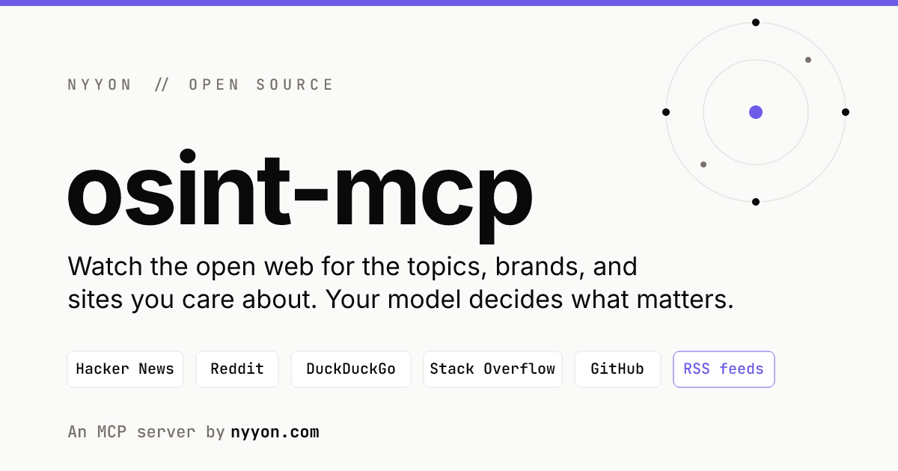

# osint-mcp

A small MCP server that watches the topics, brands, competitors, or sites you
care about across the public web and hands back the raw signal. No LLM, no
opinion baked in. The relevance score is only a hint. Your model reasons over
the results.

Built and open-sourced by [nyyon.com](https://nyyon.com).

Sources (all keyless except GitHub):

- Hacker News (Algolia search)
- Reddit (public search)
- DuckDuckGo (keyless web search)
- Stack Overflow (StackExchange API)
- GitHub Issues (optional `GITHUB_TOKEN` for higher rate limits)
- Site feed: give a target a `url` and it watches that site directly through
  its RSS or Atom feed, auto discovered from the homepage or passed in.

## Install

```bash
git clone https://github.com/LevNyyon/osint-mcp.git && cd osint-mcp
npm install
npm test
```

## Connect it

Add to your MCP client config (Claude Desktop `claude_desktop_config.json`, or
any MCP client):

```json
{
  "mcpServers": {
    "osint": {
      "command": "node",
      "args": ["/absolute/path/to/osint-mcp/src/index.js"],
      "env": {
        "GITHUB_TOKEN": "optional ghp_xxx",
        "OSINT_MCP_DIR": "optional /custom/data/dir"
      }
    }
  }
}
```

Targets and the "already seen" set persist as JSON in `OSINT_MCP_DIR` (default
`~/.osint-mcp/`).

## Tools

| tool | what it does |
|------|--------------|
| `list_sources` | the sources it can search, and which need a key |
| `add_target` | save a watch: `{ name, url?, domain?, sources? }` |
| `list_targets` | your saved watches |
| `remove_target` | drop one by name |
| `fetch_updates` | pull recent hits for one target, all targets, or an ad hoc `name` / `url`. Returns `{ source, url, text, posted_at, confidence }`. `new_only` (default true) returns only items unseen on prior fetches, so repeat calls surface just what is new. |
| `hot_takes` | fetch the latest signal AND return a keyless `recipe` your model runs to turn it into sharp, debatable hot takes (5 provocation lenses, each with its counter-argument). Still no LLM in the server: it hands your model the `signals` plus the `recipe`, your model writes the takes. |

### Typical flow

```
add_target { "name": "Anthropic", "domain": "anthropic.com" }   # watch the web
add_target { "name": "answer engine optimization" }
add_target { "url": "https://openai.com/blog" }                 # watch a site feed
fetch_updates { "since_days": 7 }
hot_takes { "name": "AI agents", "since_days": 7 }              # signal + recipe -> your model writes the takes
```

The model then reads the hits and decides what is worth your attention. `hot_takes` goes one step further: it hands your model the recipe to turn the raw signal into opinions worth publishing.

"Watch a site for new posts" means give a `url`. It defaults to feed only, so it
will not also search the web for the hostname. Repeat `fetch_updates` calls
return only posts you have not seen.

`confidence` is a coarse hint: `1.0` domain match, `0.6` name plus a product or
news cue nearby, `0.4` bare name match. Filter with `min_confidence` if you want.

## Notes

- The MCP is pull based, not push. It supplies "what is new" when asked. To get
  "tell me when new comes in," call `fetch_updates` on a schedule (a cron or a
  daily agent run) and report the new items.
- Each source is throttled and fails soft, so one flaky API will not sink a
  fetch. DuckDuckGo rate limits aggressively and may return little on bursts.
  Hacker News is the most reliable.
- This is intentionally simple. It fetches and de-dupes. No ranking model, no
  summarization. That is the client's job.

MIT. Built by [nyyon.com](https://nyyon.com).
